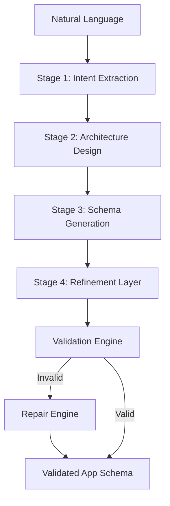

# AppCompiler — Natural Language → Validated App Schema Pipeline

AppCompiler is a multi-stage **app specification compiler** that transforms free-form natural language product descriptions into validated, execution-ready JSON application schemas.

## Architecture



### Stages Detail

1.  **Stage 1: Intent Extraction** (Gemini 1.5 Flash): Parses raw product descriptions into structured `IntentModel`.
2.  **Stage 2: Architecture Design** (Gemini 1.5 Pro): Converts intent into high-level system components (DB tables, API endpoints, UI pages).
3.  **Stage 3: Schema Generation** (Gemini 1.5 Flash): Generates detailed configurations for every component.
4.  **Stage 4: Refinement Layer** (Gemini 1.5 Flash): Cross-layer consistency check and patching.

## Tech Stack

- **Backend**: Python 3.11+, FastAPI, Pydantic v2
- **LLM**: Google Gemini 1.5 Pro & Flash
- **Frontend**: React, Vite, TailwindCSS
- **Testing**: pytest

## Setup & Installation

### Prerequisites

- Python 3.11+
- Node.js (for frontend)
- Google Gemini API Key

### Backend Setup

1.  Navigate to `app-compiler/`
2.  Install dependencies: `pip install -r requirements.txt`
3.  Configure environment: `cp .env.example .env` (Add your `GEMINI_API_KEY`)
4.  Run server: `uvicorn api.main:app --reload --port 8000`

### Frontend Setup

1.  Navigate to `app-compiler/frontend/`
2.  Install dependencies: `npm install`
3.  Run dev server: `npm run dev`

### Running Tests

```bash
cd app-compiler
pytest tests/
```

### Running Evaluation

```bash
cd app-compiler
python -m evaluation.harness --dataset standard
python -m evaluation.harness --dataset edge_cases
```

## Cost & Quality Tradeoff

| Stage | Model | Reason |
|---|---|---|
| Stage 1 (Intent) | Flash | Simple extraction, low complexity |
| Stage 2 (Architecture) | Pro | System design needs deep reasoning |
| Stage 3 (Schema) | Flash | Structured output, high volume |
| Stage 4 (Refinement) | Flash | Targeted patching, fast |
| Repair | Pro | Error correction needs careful reasoning |

## Example

**Input**: "Build a CRM with login, contacts list, and admin panel"

**Output Excerpt (Schema)**:
```json
{
  "app_name": "CRM",
  "db_config": [
    {
      "table_name": "users",
      "fields": [...]
    },
    {
      "table_name": "contacts",
      "fields": [...]
    }
  ],
  "api_config": [...],
  "ui_config": [...]
}
```
